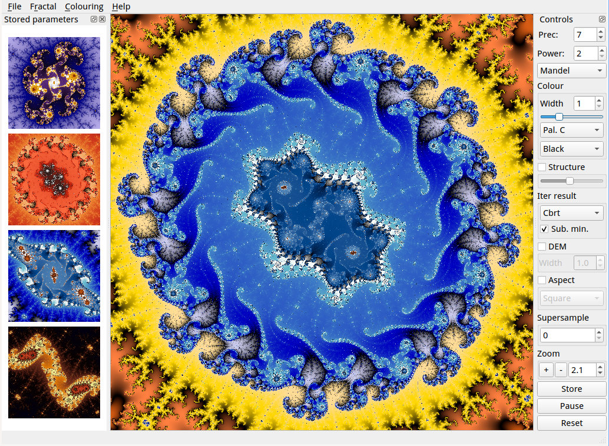

## GAPFix Fractal

This is a tool for creating Mandelbrot and Julia sets, which differs from
most of the numerous other such tools in two points. The admittedly somewhat
unwieldy name stands for GPU Arbitrary Precision Fixed Point Fractals.
Which is to say, it runs on CUDA-capable GPUs, and it uses arbitrary
precision fixed point math, compiled on the fly to any desired precision.
The goal is to be able to zoom in deeper than when using normal 64 bit
floating point math, while still getting decent speed due to the power of
modern GPUs.



At the moment, this is still very new and fairly experimental code. It's
slowly becoming a real application, but expect it to be rough around the
edges in this early stage.

## Features

GAPFix Fractal has the following main features:
- Up to 512 bits of precision currently
- Arbitrary precision kernels generated on the fly as needed
- Julia set previews
- Supersampling
- A few different formulas
- DEM black and white images for the standard formula
- Storing parameters with previews and using them for navigation

## Usage

Most of the user interface should be self-explanatory or easily
understandable for anyone who has played with fractal software before.

Left-click recenters and zooms. Control-click selects parameters for
Julia sets. The "Mixture" formula allows choosing an additional
parameter q, currently only from a few presets in the menu.

The "Store" button saves the current position for later, with a small
preview image.

## Requirements

There are some prerequisites for building and running this program:
- An nvidia GPU, let's say GTX 1060 and up.
- The Qt library for the GUI
- Linux (it should build and run on Windows once the build system is
  adapted to find CUDA there)
- A fairly large amount of memory, especially when playing with large
  resolutions and supersampling factors.

## Limitations

Among the things currently known to need improvement are:
- The DEM algorithm fails after a few zoom steps, apparently due to
  overflows.  Might need an improvement over plain fix point math.
- There are also overflow issues at higher power variants that lead
  to some banding in color gradients which are supposed to be smooth.
- The "Spider" formula doesn't produce quite the same images seen
  elsewhere on the web. Probably a math error somewhere.
- Color palettes are still somewhat haphazard and subject to change.

## Gallery

I've uploaded a [sample gallery](https://photos.app.goo.gl/fFZyEvVNFHzDMaFu5)
of images created with this program.

## Compiling

On Linux, make a build subdirectory, enter it, and run
```sh
  qmake ../src/frac.pro PREFIX=/where/you/want/to/install
```
followed by make and make install.
